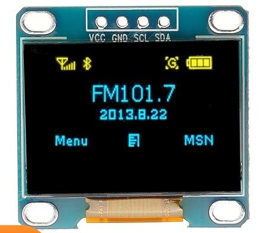
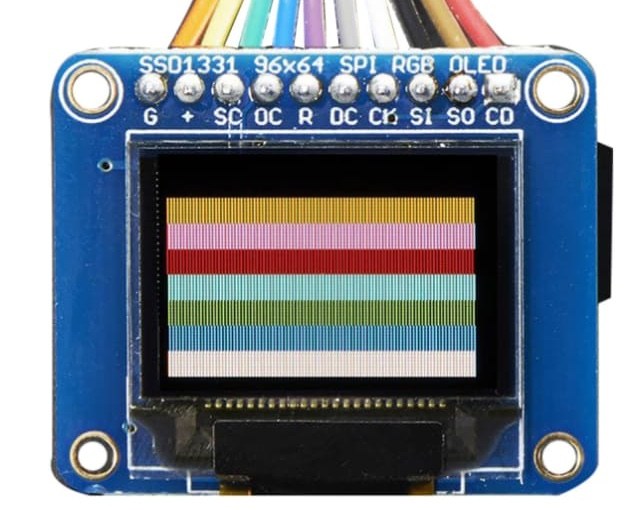
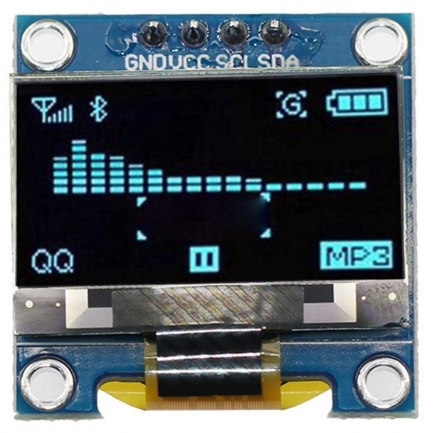
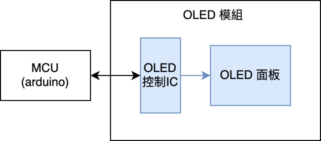
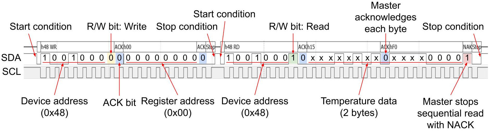
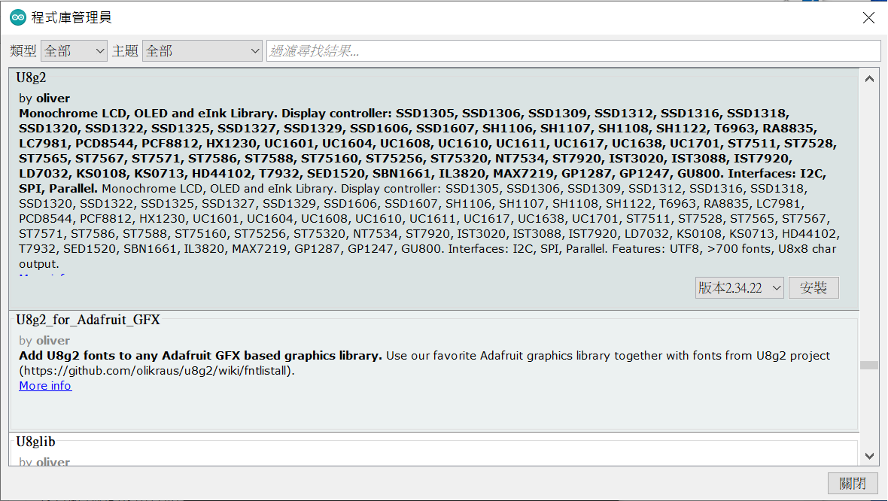
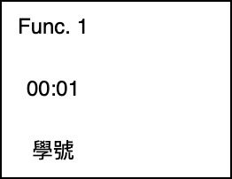
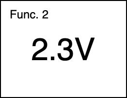

## 臺北市立松山工農112學年度第二學期電子科-感測器實習學習單 

<center><font size=6>【SSD1306 0.96吋/SH1106 1.3吋 OLED顯示螢幕】</font></center>

<div style="text-align: right">班級：______________ 座號：________姓名：________________</div>

#### 一、OLED
<center>

</center>
有機發光二極體（英語：Organic Light-Emitting Diode，縮寫：OLED），具有自發光性、廣視角、高對比、低耗電、高反應速率、全彩化及製程簡單等優點，但於大面板價格、技術選擇性 、壽命、解析度、色彩還原方面則比不上TFT-LCD（薄膜電晶體液晶顯示器）顯示器。

 

#### 二、通訊方式

OLED因控制的訊號較多，且內部處理較為複雜，因此在控制OLED時會透過模組內IC進行通訊，如下圖所示。而通訊的方式主流來說有兩種，分別是I2C與SPI。







在電路板接腳方面，因我們是使用I2C通訊的0.96吋(**128x64**) OLED以及Arduino Mega 2560開發板，故在接線的時候需要配合開發板上I2C特定接腳進行連線(**20 (SDA)**, **21 (SCL)**)。電源部分則是採用**3.3V**供電。

 

#### 三、函式庫安裝

U8g2



#### 四、程式說明

```c {.line-numbers}
#include <Wire.h>
#include <U8g2lib.h>

// 設定OLED
//OLED顯示器使用2C連線並宣告名為display物件
//U8G2_SSD1306_128X32_UNIVISION_1_HW_I2C u8g2(U8G2_R0, /* reset=*/ U8X8_PIN_NONE, /* clock=*/ SCL, /* data=*/ SDA);   // pin remapping with ESP8266 HW I2C
U8G2_SH1106_128X64_NONAME_1_HW_I2C u8g2(U8G2_R0, /* reset=*/U8X8_PIN_NONE);

void testdrawstyles(void) {
  u8g2.firstPage(); 
  do {
    u8g2.setFont(u8g2_font_8x13_tf); // 使用 8*13 字型
    u8g2.setCursor(25, 10); // 設定起始座標
    u8g2.print("Hello OLED"); // 要顯示的字串
    u8g2.setCursor(25, 50); // 設定起始座標
    u8g2.setFont(u8g2_font_spleen16x32_me); // 使用 16*32 字型
    u8g2.printf("%s", "SAIHS"); // 要顯示的字串
    // 如果不支援 printf，請改用下列方法
    // char buf[10]; 
    // sprintf(buf,"%s","SAIHS");
    // u8g2.print(buf);
  } while (u8g2.nextPage());
  delay(1000);
}

void setup() {
  u8g2.begin(); // 使用 OLED了
  testdrawstyles(); // 測試文字
  delay(1000);
}

void loop() {}
```

 

#### 五、自我練習

1. 請製作一個計時器顯示於OLED，時間變化如下：00:00 > 00:01 >…> 00:59 > 01:00 >…，並於空白處顯示自己的學號，字體大小可自行調整。 (請利用 millis() 完成，勿使用 delay() )

2. 請使用可變電阻及OLED完成一個簡易電壓表，於OLED上顯示目前可變電阻之電壓，字體大小可自行調整。(建議用 sprintf() 及 map() )

3. 請將上述功能整合於一個專案中，並且可以使用滑動開關進行功能切換(Func. 1 <-> Func. 2)

<center>
 
</center>

4. 請改用按鈕開關完成上題功能。(建議使用程式庫 OneButton)