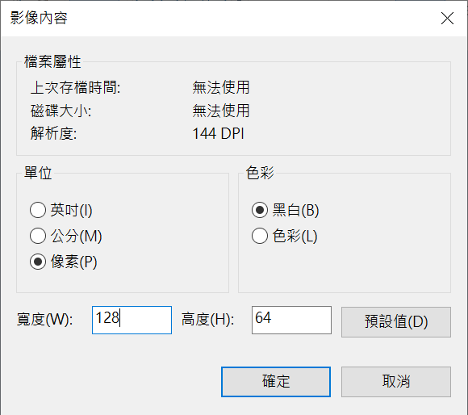

## 臺北市立松山工農112學年度第二學期電子科-感測器實習學習單

<center><font size=6>【OLED 繪圖介紹與說明】</font></center>

<div style="text-align: right">班級：______________ 座號：________姓名：________________</div>

#### 一、繪圖簡介

<center>

</center>


我們於前一節已經介紹了如何控制OLED輸出文字，並且還可以做出相關應用功能，但想想是否還缺少些甚麼？既然有了顯示器，何不能顯示圖形呢！人類在觀看文字與圖像時，更能夠在第一時間了解圖像所代表的涵義。走在馬路上處處都可以見到各種不同樣式的顯示招牌或螢幕，可見圖像於我們日常生活中有多重要了。

 

#### 二、U8g2 函式庫

U8g2 為一個圖像繪圖的函式庫，內涵很多繪圖相關的指令可以運用，我們Arduino搭配OLED也是透過該函式庫達成不同圖形的繪製，讓我們一起來看看內部有何程式可以使用吧！

u8g2 繪圖座標原點在左上角，往右是X軸，往下是Y軸

以下函式使用方式例如在(30,60)的地方畫一個點: 

``` c 
u8g2.drawPixel(30, 60) ; 
```

 

(一) 繪製點
``` c
void drawPixel(uint16_t x, uint16_t y);
```
在本函式中，僅需輸入x與y的座標位置即可對該點進行著色。

(二) 繪製直線
``` c
void drawLine(uint16_t x0, uint16_t y0, uint16_t x1, uint16_t y1);
```
在本函式中，填入兩點座標(x0, y0)與(x1, y1)即可於該兩點間繪製一直線。

(三) 繪製長方形
``` c
void drawBox(uint16_t x0 uint16_t y0, uint16_t w, uint16_t h, uint16_t color);
void drawFrame(uint16_t x0, uint16_t y0, uint16_t w, uint16_t h, uint16_t color);
```
在本函式中包含了兩種繪製長方形的方式，一種是繪畫長方形外框(drawFrame)，另一種則為實心長方形(drawBox)。首先定位長方形左上角為(x0, y0)後，再輸入寬度(w)與高度(h)，即可繪製一長方形，如圖所示。


(四) 繪製圓形

``` c
void drawCircle(uint16_t x0, uint16_t y0, uint16_t r, uint16_t opt);
void drawDisc(uint16_t x0, uint16_t y0, uint16_t r, uint16_t opt);
```
在本函式中包含了兩種繪製圓形的方式，一種是繪畫圓形外框(drawCircle)，另一種則為填滿圓形(fillCircle)。首先定位圓形的圓心點位為(x0, y0)後，再輸入半徑(r)，即可繪製一圓形。opt是選項，可以是以下各項值：

- ​	U8G2_DRAW_UPPER_RIGHT → 左上角弧度
- ​	U8G2_DRAW_UPPER_LEFT → 右上角弧度
- ​	U8G2_DRAW_LOWER_LEFT → 左下角幅度
- ​	U8G2_DRAW_LOWER_RIGHT → 右下角幅度
- ​	U8G2_DRAW_ALL → 全圓

 (五) 繪製Bitmap圖像

``` c
void drawXBM(int16_t x, int16_t y, int16_t w, int16_t h, uint8_t *bitmap);
void drawXBMP(int16_t x, int16_t y, int16_t w, int16_t h, uint8_t *bitmap);
```
本函式可以繪製點陣圖(Bitmap)，函式輸入方式可以參考長方形的方式，先設定一個左上角定位點(x0, y0)，接著再設定其寬度(w)與高度(h)，最後也要輸入圖形的資料於*bitmap中，請注意*代表著該變數宣告成指標形態，其使用方式可參考後面節次。

(六) 清除畫面
``` c
void clear()
```

清除緩衝區"Buffer"內的所有圖元點，游標回到左上角原點。

(七) 參考資料

其他指令請參考 [https://github.com/olikraus/u8g2/wiki/u8g2reference](https://github.com/olikraus/u8g2/wiki/u8g2reference)


#### 三、Bitmap資料轉換

首先可於電腦內小畫家中開啟一空白畫布，接著設定其長寬為OLED的大小，例如(128*64)後即可開始作畫。在 小畫家/檔案/內容 做設定即可。



可透過線上的 png 轉 xbm 的網站，轉成 U8g2 可用的資料。下載來的檔案，只要將副檔名改為 xbm -> txt, 即可看到文字的內容，將所要的部分複製到程式碼中即可。 


或是利用 GIMP 將 png 轉存成 xbm 也可以。可參考影片:https://www.youtube.com/watch?v=ac5CYQ3OJ7c&list=PLO2D4fDkIZCVG0tF_QvZqrIN6djy4-Z6i&index=3

#### 四、自我練習

1. 請試著於 OLED 上利用上述指令繪製一個圖形，該圖形如下：


2. 請小畫家中隨意繪畫一個圖形，並且將該圖形顯示於OLED(請加上學號或姓名)