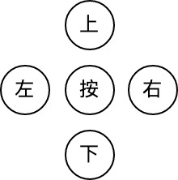

## 臺北市立松山工農112學年度第二學期電子科-感測器實習學習單 

<center><font size=6>【Joystick 搖桿模組(香菇頭)】</font></center>

<div style="text-align: right">班級：______________ 座號：________姓名：________________</div>

#### 一、Joystick
<center>
</br>


</center>

搖桿（英語：Joystick）是一種輸入設備，由基座和固定在上面作為樞軸的主搖桿組成，作用是向其控制的設備傳遞角度或方向信號。現時搖桿主要用來操縱電子遊戲，通常有一個或多個按鈕，按鈕的狀態也可被電腦識別。(From wikipedia)

 

#### 二、使用方式

<center>


</center>

搖桿上的感測有兩個部分，首先是X-Y方向的轉動，這兩方向會有個一個可變電阻作為分壓調整，分壓出來的訊號即為X或Y軸方向的轉動大小；其次為搖桿按下的按鍵，此案件藏於搖桿下方，按鍵的使用方式和一般的按鈕開關一樣。

 


 

在模組接腳方面一共有五支腳位需要接上，分別是GND、+5V、VRx、Vry、SW。電源請使用5V並接至+5V與GND腳位。VRx與VRy為X與Y軸的訊號輸出，該輸出為類比訊號，可以接至Arduino的類比輸入接腳(A0, A1等)。SW則是搖桿按鈕接腳，此為數位訊號施出，因此可以接至Arduino的數位訊號腳位。

 

#### 三、程式說明


``` c
// Arduino pin numbers
const int SW_pin = 8; // digital pin connected to switch output
const int X_pin = 0; // analog pin connected to X output
const int Y_pin = 1; // analog pin connected to Y output

void setup() {
 pinMode(SW_pin, INPUT);
 digitalWrite(SW_pin, HIGH);
 Serial.begin(9600);
}

void loop() {
 Serial.print("Switch: ");
 Serial.print(digitalRead(SW_pin));
 Serial.print(" | ");
 Serial.print("X-axis: ");
 Serial.print(analogRead(X_pin));
 Serial.print(" | ");
 Serial.print("Y-axis: ");
 Serial.print(analogRead(Y_pin));
 Serial.println(" | ");
 delay(200);
}

```


#### 四、自我練習

1. 請用電表量測並觀察，當模組的接腳文字面對你時，X軸向右移動時，VRx電壓如何變化？Y軸向上移動時，VRy電壓如何變化？按鈕按下為低態還是高態？

2. 請使用5個LED表示目前搖桿的移動狀態，搖桿向上移動時，上方LED點亮，右方下方與左方移動時也會點亮對應的LED。按鈕按下時，會點亮中央的LED。(提示可用if else判斷)



 

3. 請使用單軸控制2個LED的亮暗程度，以X軸為例，當搖桿撥向右側，右方LED會為最亮，輕輕撥向右側則次亮；反之撥向左側則左方LED最亮，輕輕撥向左側則次亮。(需使用analogWrite PWM控制)

4. 請使用單軸控制3個LED狀態，假設原LED狀態為●○○，搖桿向右撥到底後回到中央，LED則會向右移動一格○●○，再次向右撥到底回到中央會使LED再移動一格○○●，此時再撥向右側則不移動。反知，向左側撥則會使LED向左移動一格。(提示可採用類似按鈕防彈跳方式判斷)

5. 嘗試將 https://wokwi.com/projects/296135008348799496 貪吃蛇改成利用 joystick 控制。
