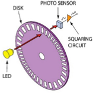
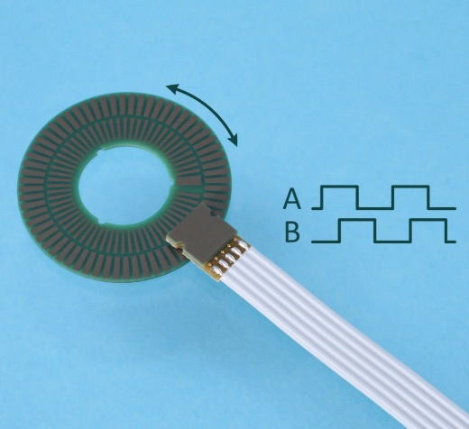
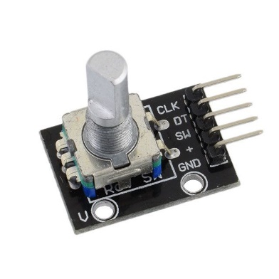
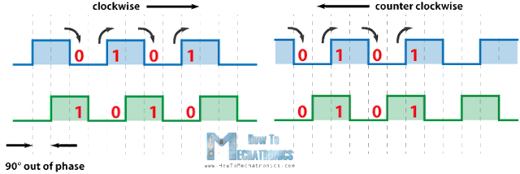

## 臺北市立松山工農112學年度第二學期電子科-感測器實習學習單 

<center><font size=6>【Rotary Encoder旋轉編碼器】</font></center>

<div style="text-align: right">班級：______________ 座號：________姓名：________________</div>

#### 一、Rotary Encoder

<center>
  
</center>


旋轉編碼器（rotary encoder）也稱為軸編碼器，是將旋轉位置或旋轉量轉換成類比或數位訊號的機電裝置。一般裝設在旋轉物體中垂直旋轉軸的一面。旋轉編碼器用在許多需要精確旋轉位置及速度的場合，如工業控制、機器人技術、專用鏡頭、電腦輸入裝置（如滑鼠及軌跡球）等。(From wikipedia)

 


​                                 

##### 二、使用方式

<center>
 
</center>

[參考資料](https://howtomechatronics.com/tutorials/arduino/rotary-encoder-works-use-arduino/)

 

#### 三、程式說明

``` c{.line-numbers}
#define outputA 6 //定義 outputA = 6
#define outputB 7 //定義 outputB = 7

int counter = 0; //定義 counter 為 int 類型變數，且初始值為0
int aState; //定義 aState 為 int 類型變數
int aLastState; //定義 aLastState 為 int 類型變數

void setup() {
  pinMode(outputA, INPUT); //埠口模式設定：outputA 設為 輸入
  pinMode(outputB, INPUT); //埠口模式設定：outputB 設為 輸入
  Serial.begin(9600); //Serial通訊鮑率設為9600
  aLastState = digitalRead(outputA); //將初始outputA的讀取值 設給 aLastState
}

void loop() {
  aState = digitalRead(outputA); //將outputA的讀取值 設給 aState
  if (aState != aLastState) { //條件判斷，當aState 不等於 aLastState時發生 
    if (digitalRead(outputB) != aState) { //條件判斷，當outputB讀取值 不等於 aState時發生
      counter++; //計數器+1
    } else {
      counter--; //計數器-1
    }

    Serial.print("Position: "); //透過serial印出字串 Position: 
    Serial.println(counter); //透過serial印出 counter 值
    delay(20); //避免系統誤動作
  }

  aLastState = aState; //將aState 最後的值 設給 aLastState
}

```

 可利用程式庫: Ai Esp32 Rotary Encoder

#### 四、自我練習

1. 請使用4個LED表示目前旋轉的狀態，預設狀態為○○○○。編碼器順時鐘旋轉為●○○○，持續旋轉則會●●○○，●●●○，●●●●；逆時針旋轉則會：●●●○，●●○○，●○○，○○○○。


2. 請使用蜂鳴器、按鍵與旋轉編碼器，當旋轉編碼器順時鐘旋轉則會將蜂鳴器的頻率往上調(+50Hz)；逆時針旋轉則會往下調(-50Hz)，按下按鍵後則會關閉蜂鳴器發聲，再按一下則會繼續發聲。系統重置後預設為400Hz不發聲。

 
