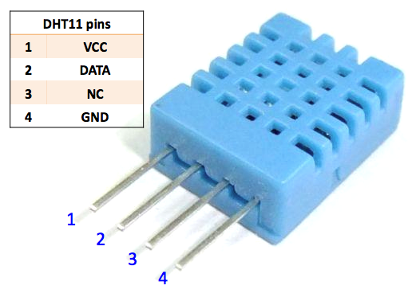
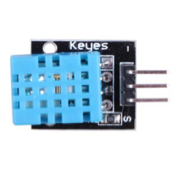
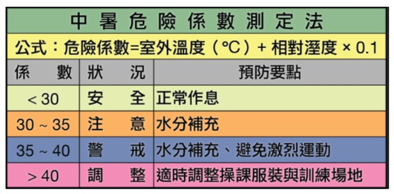

## 臺北市立松山工農112學年度第二學期電子科-感測器實習學習單 

<center><font size=6>【Temperature and Humidity Sensor 溫濕度感測器(DHT11)】</font></center>

<div style="text-align: right">班級：______________ 座號：________姓名：________________</div>

#### 一、溫溼度計

<center>

</center>


溫度是表示物體冷熱程度的物理量，微觀上來講是物體分子熱運動的劇烈程度。溫度只能通過物體隨溫度變化的某些特性來間接測量，而用來量度物體溫度數值的標尺叫溫標。目前國際上用得較多的溫標有攝氏溫標（°C）、華氏溫標（°F）和熱力學溫標（K）。溫度測量的方法有數十種，按照測量原理可以分為以下幾類：膨脹測溫法、電學測溫法、磁學測溫法等。(From wikipedia)

相對濕度（英文：relative humidity）是指單位體積空氣中，實際水蒸氣的分壓與相同溫度和體積下水飽和蒸氣壓的百分比。隨著溫度的增高空氣中可以含的水就越多，也就是說，在同樣多的水蒸氣的情況下溫度降低相對濕度就會升高。測量方式可以分為以下幾類：乾濕球式、氯化鋰、氧化鋁式。(From wikipedia)


#### 二、使用方式

<center>
   
</center>

DHT11是一個兼備溫度及濕度的感測器，測量方法為電學量測法(使用NTC)，通常可以用於家庭環境監控、工廠監控等環境使用。DHT11工作電壓為3~6V，溫度量測範圍0~50°C，誤差在±2°C；濕度量測範圍為20~90%RH，誤差在±5%RH。DHT11電路非常簡單，除了電源接腳外僅需要一支I/O即可收取感測器資料。訊號傳輸方式使用1-Wire協定，詳細如下圖：


#### 三、函式庫安裝

Adafruit DHT Sensor
Adafruit Unified Sensor


#### 四、程式說明

``` c{.line-numbers}
#include "DHT.h"

#define DHTPIN 9
#define DHTTYPE DHT11
//#define DHTTYPE DHT22  // DHT 22 如果用的是DHT22，就用這行

DHT dht(DHTPIN, DHTTYPE);

void setup() {
  Serial.begin(115200);
  Serial.println("DHT11 test!");
  dht.begin(); //初始化DHT
}

void loop() {
  delay(1000);
  float h = dht.readHumidity(); //取得濕度
  float t = dht.readTemperature(); //取得溫度C

  //顯示在監控視窗裡
  Serial.print("Humidity: ");
  Serial.print(h);
  Serial.print(" %\t");
  Serial.print("Temperature: ");
  Serial.print(t);
  Serial.println(" *C ");
}
```

#### 五、自我練習

1. 請將範例程式做修改，增加一個按鈕可以切換攝氏溫標與華氏溫標，並顯示於PC上，公式：$°C= {5 \over 9}(°F-32) $ 

2. 請計算中暑危險係數(濕度*0.1+攝氏溫度)，並利用三色LED代表危險係數分級：係數>=40顯示紅燈，40>係數>=35顯示黃燈，係數<35顯示藍燈。溫度、濕度與危險係數須顯示於PC上。

<center>
 
</center>
 

3. 承上題，為了避免中暑需要於環境中安裝風扇，請利用分級進行風扇(PWM)控制。
    安全狀況中PWM控制為0%；
    注意狀況中PWM控制為40%；
    警戒狀況中PWM控制為80%；
    危險狀況中PWM控制為100%。

