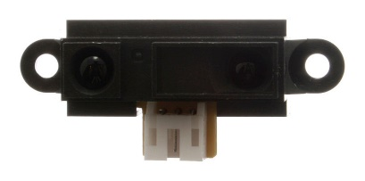
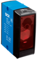
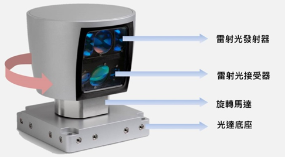
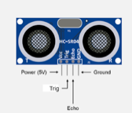
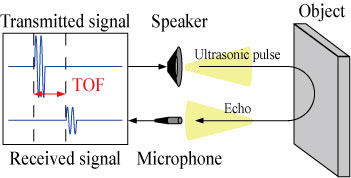

## 臺北市立松山工農112學年度第二學期電子科-感測器實習學習單 

<center><font size=6>【Ultrasonic Sensor 超音波距離感測器(HC-SR04)】</font></center>

<div style="text-align: right">班級：______________ 座號：________姓名：________________</div>

#### 一、距離感測器

  

距離(鄰近)感測器通常發射**電磁場或電磁輻射束（例如紅外線）**並觀察電場或**返回訊號**的變化來實現功能，同時感測器上都有設計上定義的「標稱範圍」，即可檢測的最大距離。感測器沒有機械部件，並且感測器與被感測物體之間沒有物理接觸，因而具有**高可靠性和長使用壽命**。調校到超短距離的鄰近感測器也可作為一個輕觸開關。(From wikipedia)

可以分為以下幾種類型：磁性、光學、聲納、雷達、超聲波。

可應用於：倒車雷達、地面迫近警告系統、行動裝置、自動水龍頭。

 

#### 二、使用方式


    


超音波距離感測器 HC-SR04，是利用超音波射出和反射的時間差，來測定感測器和障礙物之間的距離。如圖所示：感測器有兩個筒狀物，其中一個為超音波發射器 (Transmitter)，另一個為接收器 (Receiver)。當發射的超音波遇到感測器前方的障礙物後，會被反射。接收器接到反射的超音波後，會計算出從發射到接收的時間差(ToF：Time of Flight)。在氣溫不變下，超音波在空氣中傳播速度是固定的。ToF乘以傳播速度，就可以得到感測器和障礙物之間的距離。

 

音速於攝氏零度之海平面音速約為331.5公尺/秒，每升高1攝氏度，音速就增加0.607公尺/秒

v = 331.5 + 0.607 * t (其中 t 為攝氏溫度)。

攝氏20度時的音速約為： 331.5 + 0.607*20 = 343.64 公尺/秒

音速公尺/秒 換算成 公分/微秒：343.64 * 100 / 1000000 = 0.034364 公分/微秒，亦即

音速每公分需要29.1 微秒： 1 / 0.034364 = 29.1 微秒/公分


#### 三、程式說明


``` C
int trigPin = 11; //Trig Pin
int echoPin = 12; //Echo Pin
float duration, cm;

void setup() {
  Serial.begin(9600); //Serial Port begin
  pinMode(trigPin, OUTPUT); //定義輸入及輸出 
  pinMode(echoPin, INPUT);
}

void loop() {
  digitalWrite(trigPin, LOW);
  delayMicroseconds(5);
  digitalWrite(trigPin, HIGH); //給 Trig 高電位，持續 10微秒
  delayMicroseconds(10);
  digitalWrite(trigPin, LOW);
  duration = pulseIn(echoPin, HIGH); //收到高電位時的時間
  cm = (duration / 2) * 0.034364; // cm = (duration/2) / 29.1;
  Serial.print(cm);
  Serial.println(" cm");
}
```

 

#### 四、自我練習

1. 請使用一個蜂鳴器與3色LED模擬車輛倒車的提示，距離10cm內蜂鳴器持續聲響(紅色)；距離10-15cm則每0.5秒一次聲響(黃色)；距離15~20cm則每1秒一次聲響(綠色)；距離超過20cm則不聲響(藍色)。(蜂鳴器頻率不拘，聽得到即可)

 

2. 請使用一個蜂鳴器與一個按鈕完成空氣吉他的功能，按著開關的時候，當超音波感測距離越近，則會使蜂鳴器音調變高；反之則會使蜂鳴器音調降低。放開開關則不會使蜂鳴器發聲。

 

3. 請使用七段顯示器與超音波感測器達到人員計數功能，人員通過超音波感測器時，距離反應會是長距離>短距離>長距離，運用這個訊號達到人數計數，計數資料顯示於七段顯示器上。(可利用類似按鈕防彈跳方式判斷)

 
