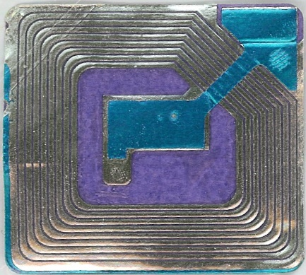
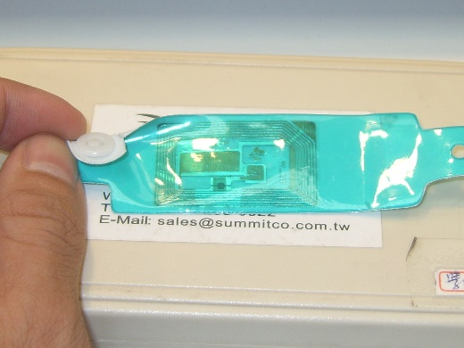
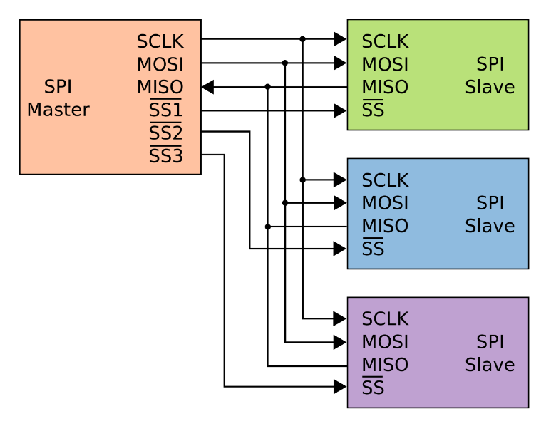
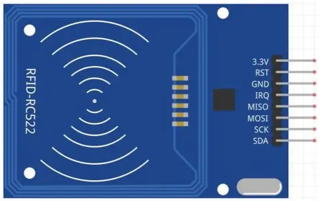

## 臺北市立松山工農112學年度第二學期電子科-感測器實習學習單 

<center><font size=6>【RFID無線射頻辨識 (MFRC522)】</font></center>

<div style="text-align: right">班級：______________ 座號：________姓名：________________</div>

#### 一、無線射頻辨識

<center>
  
</center>


RFID是一種無線通訊技術，可以通過無線電訊號識別特定目標並讀寫相關數據，而無需識別系統與特定目標之間建立機械或者光學接觸。

無線電的訊號是通過調成無線電頻率的電磁場，把數據從附著在物品上的標籤上傳送出去，以自動辨識與追蹤該物品。某些標籤在識別時從識別器發出的電磁場中就可以得到能量，並不需要電池；也有標籤本身擁有電源，並可以主動發出無線電波（調成無線電頻率的電磁場）。標籤包含了電子儲存的資訊，數公尺之內都可以識別。與條碼不同的是，射頻標籤不需要處在識別器視線之內，也可以嵌入被追蹤物體之內。(From wikipedia)

可以依驅動方式分為以下幾種類型：主動式、半被動式、被動式。也可以依頻段作區分。

(補充RFID是一種傳輸技術，NFC是一種傳輸協定，該協定採用RFID的技術。)

 

#### 二、使用方式 (函式庫：MFRC522)

<center>
 
</center>

MFRC522模組是採用SPI協定之串列傳輸方式，該協定下一共會有4支腳位作使用，分別是：SS, SCLK(13), MOSI(11), MISO(12)。除了SS以外的腳位，在Arduino UNO都已經有特定之接腳連接。

RFID感應卡中儲存了UID的資訊，通常在簡單的保全系統中可以利用該UID做卡片之識別。此外常用的卡片中還會有1KB的EEPROM可以使用，可以在該內部自行規畫要儲存的相關資訊，例如停車卡中可以儲存停車時間、權限範圍等等的資訊，甚至為了資訊安全還可以為每個暫存器進行加密，防止其他有心人士盜用。

#### 三、程式說明

``` c
#include <SPI.h>
#include <MFRC522.h>

#define rstPin 9 //重置腳位
#define ssPin 10 //晶片選擇腳位

MFRC522 mfrc522(ssPin, rstPin);

void setup() {
  Serial.begin(9600);
  SPI.begin();
  mfrc522.PCD_Init(); //初始化
}

void loop() {
  if (mfrc522.PICC_IsNewCardPresent()) { //是否有新卡片
    if (mfrc522.PICC_ReadCardSerial()) { //是否正常讀取
      byte * id = mfrc522.uid.uidByte; //讀取卡片ID
      byte idSize = mfrc522.uid.size; //卡片ID的長度
      for (byte i = 0; i < idSize; i++) {
        Serial.print("0x");
        Serial.print(id[i], HEX); //顯示id
        Serial.print(" ");
      }

      Serial.println();
    }

    mfrc522.PICC_HaltA(); //暫停，避免重複讀取
  }

}
```

四、自我練習

1. 請撰寫以上範例程式，並記錄其UID識別碼： 

2. 請使用一個3色LED，並將自己的UID識別碼寫入陣列中儲存，例如：const byte myID[4]={0x00, 0x00, 0x00, 0x00};。將同學的RFID卡作交換並掃描識別，嘗試判斷兩組UID是否一致，若不一致則控制LED亮紅燈；若一致則亮綠燈。

3. *請修改試題二，再增加一個伺服馬達與蜂鳴器。功能二保持不變之下，若判斷不一致馬達會保持在0度位置；一致的話則會移動至90度，過5秒自動轉至0度。此外若連續偵測不一致達三次，則會使蜂鳴器發出聲響3秒，3秒後關閉聲響。

 
