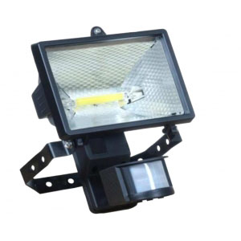
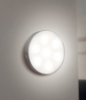
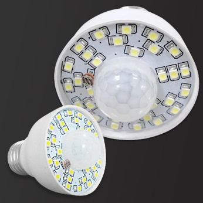
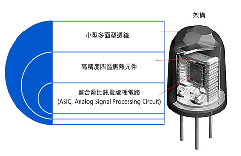
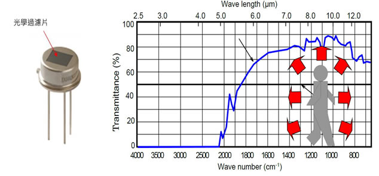
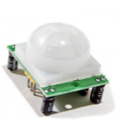
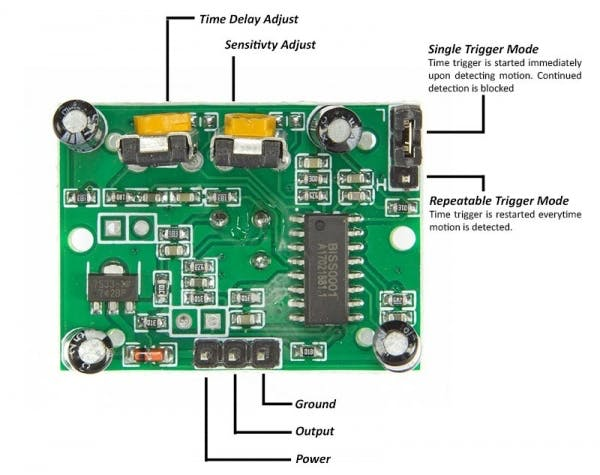
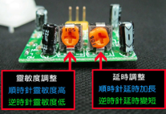

## 臺北市立松山工農112學年度第二學期電子科-感測器實習學習單 

<center><font size=6>【PIR Motion Sensors 被動紅外線感測器】</font></center>

<div style="text-align: right">班級：______________ 座號：________姓名：________________</div>

#### 一、PIR Motion Sensors

<center>
  
</center>

Passive Infra-Red(PIR) Motion Sensors直譯是「被動紅外線感測器」，通常在安防行業，感測器多稱為detector。PIR感測器主要由光學系統、紅外線感測器和電子電路等部分組成，架構示意如圖所示。紅外線感測器常見的是焦電式感測器(Pyro-electric Infrared Sensor)，原理是感測器接受到特定波長範圍的紅外線，會會影響到感測器的接受器元件，產生電位差的訊號，光學系統主要有反射式和透鏡式兩大類。(from oslens.com)

<center>
 
</center>


人體體溫在36.5°C，這時人體會自然釋放出紅外線，波長約在9000nm ~10000nm；此為人體自然的發出波長範圍，和其他無生命的物體相比較，人體發出的紅外線是有鑑別度的(溫體動物也會發出接近的波段)；針對此特性，業界利用鍍膜技術，盡量把低於600nm的非紅外波段的光線濾掉如圖三所示，再配合能接收到紅外波段範圍的感測器，就是一款常規的PIR sensor。(from oslens.com)

 

#### 二、使用方式 (HC-SR501)

<center>
  
</center>

HC-SR501 是基於紅外線技術的自動控制模組，採用德國原裝進口 LHI778 探頭設計，靈敏度高，可靠性強，超低電壓工作模式，廣泛應用於各類自動感應電器設備，尤其是乾電池供電的自動控制產品。感測方式為：即感應輸出高電位後，延時時間段一結束，輸出將自動從高電位變成低電位。

#### 三、程式說

``` C
int ledPin = 13; // LED 
int pirPin = 2; // PIR Out pin 
int pirStatus = 0; // PIR status

void setup() {
  pinMode(ledPin, OUTPUT);
  pinMode(pirPin, INPUT);
  Serial.begin(9600);
}

void loop() {
  pirStatus = digitalRead(pirPin);
  if (pirStatus == HIGH) // if motion detected
  {
    digitalWrite(ledPin, HIGH); // turn LED ON
    Serial.println("Hey I got you!!!");
  } 
  else 
  { // turn LED OFF if we have no motion
    digitalWrite(ledPin, LOW);
  }
}
```

#### 四、自我練習

1. 請嘗試燒錄範例程式，並且旋轉調整延時可調電阻，紀錄最長及最短感應時間大約為何時？

2. 請加上四個LED達到省電型跑馬燈功能，當感應到人員時，讓LED持續右移變化；若無人員則停止。

3. 請加上一個蜂鳴器、一個指撥開關、一個三色LED，完成防盜警示系統。
    當開關ON時啟動系統：LED亮黃燈，若有人員感測到則蜂鳴器發聲3秒，LED改為紅燈，3秒後停止聲音並顯示黃燈。
    當開關OFF時關閉系統：LED亮綠燈，紅外線感應無功能。

4. *請加上一個七段顯示器達到人員計數功能，人員通過紅外線感測器時，計數人員數量，資料顯示於七段顯示器上。
