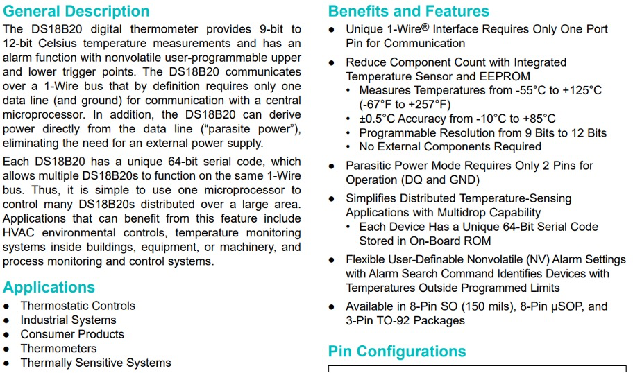
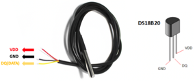
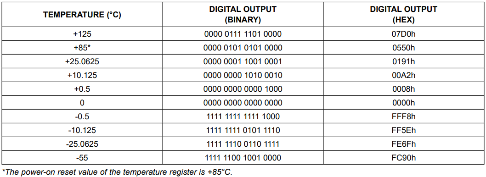

## 臺北市立松山工農112學年度第二學期電子科-感測器實習學習單 

<center><font size=6>【防水型溫度感測器】</font></center>

<div style="text-align: right">班級：______________ 座號：________姓名：________________</div>

#### 一、使用方式 (DS18B20)

溫度感測器有很多種類型，例如類比感測型的LM35、附帶濕度的數位感測型的DHT11，本次介紹的是僅有溫度感測，且為數位傳輸方式的DS18B20。DS18B20是DALLAS公司生產的數位溫度感測器，使用1-Wire傳輸方式不僅使用的腳位較少，比起類比型的感測器擁有更高的準確度。DS18B20溫度感測範圍可從-55°C量測至+125°C，而且擁有±0.5°C的準確度，比起DHT11更為精準。

<center>

</center>

DS18B20一共有3隻腳位，VCC可以接受3.0V至5.5V，DQ為資料傳輸腳位，在使用時必須要安裝47K提升電阻至VCC。防水型構造於外包裝上面增加不鏽鋼金屬，並且使用防水膠將其隔絕，避免水與接腳接觸導致短路發生。



DS18B20使用於Arduino上須安裝OneWire與DallasTemperaturec函式庫。

#### 二、程式說明

``` c
#include <OneWire.h>
#include <DallasTemperature.h>

#define DQ_Pin 2

OneWire oneWire(DQ_Pin);

DallasTemperature sensors( & oneWire);

void setup(void) {
  Serial.begin(9600);
  sensors.begin();
}

void loop(void) {
  Serial.print("Temperatures --> ");
  sensors.requestTemperatures();
  Serial.println(sensors.getTempCByIndex(0));
  delay(1000);
}

```

#### 三、自我練習

1. 請嘗試燒錄範例程式，並且將溫度資料顯示於OLED上。 

2. 請於OLED顯示以下圖片資訊，設定(Set)溫度預設為35度C，並顯示於OLED上。同時Arduino控制繼電器模組/LED啟動，並且當溫度達到設定之溫度後即會將繼電器模組/LED關閉，以維持於設定之溫度。


3. 承上題，用旋轉編碼器按鈕切換設定模式或烹煮模式。上電後即進入設定模式，OLED 會顯示 “Setting Mode”，此模式下用旋轉編碼器設定溫度。按下旋轉編碼器後進入烹煮模式，OLED 會顯示 “Cooking Mode”，此模式下Arduino將會依第二題方式對繼電器進行控制，再按下按鈕後即回到設定模式。

 
