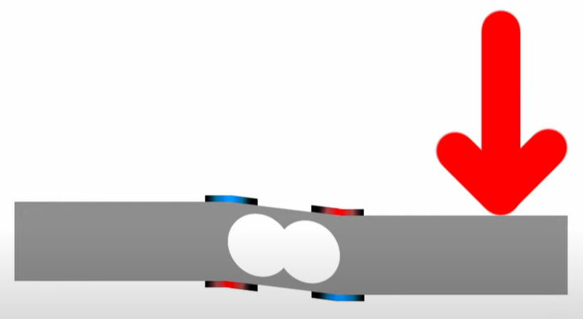

## 臺北市立松山工農112學年度第二學期電子科-感測器實習學習單 

<center><font size=6>【Load Cell Sensor 秤重感測器】</font></center>

<div style="text-align: right">班級：______________ 座號：________姓名：________________</div>

#### 一、秤重感測器

<center>
  
</center>

秤重感測器是一個可以偵測物體重量或是施加力道的感測器，其感測方式是採用電阻式的原理，並透過電壓分壓方式，可以得到會隨著施加力道與電壓大小有關的數據，最後透過這些數據進行標準化 (Normalize)即可推算出重量或是力道等等常用的參數。

#### 二、荷重元 (Load Cell)

<center>
  
</center>


荷重元是一個金屬製的物體，該物體上方有四個應變器(彎曲感測器)。當荷重元單一方向受力時，內部四個應變器便會彎曲，產生不同電阻的偏差。再透過惠斯登電橋方式連接後，即可從中的檢流計了解力道施加在物體上的程度，藉由該數據即可推算出物體的重量。

 

#### 三、高精度電子秤重感測器24位A/D轉換器(HX711)

   


安裝函式庫：HX711 Arduino Library (by Bogdan Necula, Andreas Motl)

 

#### 四、程式說明

``` c
#include "HX711.h"

const int DT_PIN = 6;
const int SCK_PIN = 5;

float val;

HX711 scale;

void setup() {
  scale.begin(DT_PIN, SCK_PIN);
  Serial.begin(9600);
}

void loop() {
  val = 0;
  for (int i = 0; i < 10; i++) {
    val += scale.read();
    delay(1);
  }

  val /= 10;
  // 7870為無重量讀值、57170為負重(100g)讀值 (這兩個參數每個人都不一樣！)
  // val=(val-7870)\*100/(57170-7870); 
  Serial.println(val);
  delay(100);
}
```

#### 五、自我練習

1. 請嘗試燒錄範例程式，並且記錄下來你的裝置無重量讀值、負重讀值，最後套入公式看看結果？

2. 請修改範例程式並加上兩個按鈕開關，按下一個按鈕開關後則會開始進行歸0校正；按下另一個按鈕開關後會開始進行負重校正。

3. 請加上四個LED做重量的判斷，無燈號<100g；一個燈<200g；兩個燈<300g；三個燈<400g；四個燈>400g；若>500g則會使所有LED閃爍，頻率為0.5Hz；

*請設計一個猜重量的遊戲，在開始前可以由電腦端輸入’C’進行歸0校正，輸入’S’即開始遊戲。開始遊戲後輸入數值後即可回傳比目前數值大還小訊息，若重量一致的話即回傳”Bingo!”，並且結束遊戲後會回到開始前狀態。
 (Hint: 利用Serial.parseInt(); 函式傳送整數，例如int num 
