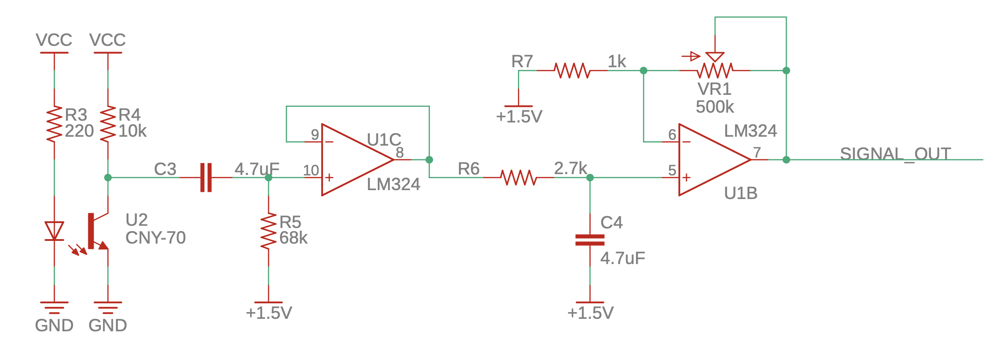

## 臺北市立松山工農112學年度第二學期電子科-感測器實習學習單 

【心率感測器 PPG Sensor (Hardware)】

班級：______________ 座號：________姓名：________________

#### 一、Photoplethysmography, PPG

 

光體積變化描記圖法 (英語：Photoplethysmography, PPG) 是以光學的方式取得的器官體積描記圖（英語：plethysmogram），一般通過脈搏血氧儀（英語：pulse oximetry）來照射皮膚並測量光吸收的變化量來實現。一般的脈膊血氧儀是用來偵測血液灌注到真皮與皮下組織的狀況。(from: wiki)

#### 二、PPG感測器電路原理

1. 紅外線發射時，光線穿透手指得知目前血管內血液含量，將反射訊號由紅外線接收器接收。

2. 將接收的電壓變化經過高通濾波器**濾除人體低頻訊號**，例如手指移動、呼吸訊號等等。

3. 接著經過低通濾波器，**濾除人體高頻訊號**，例如市電雜訊。

4. 因原訊號電壓較小，必須經過放大器才能將其訊號放大，較容易觀察及程式演算。

5. 左方半電壓適用於將PPG訊號維持在電源電壓的一半，如此才會有較大不失真的訊號。

#### 三、元件介紹 

 

#### 四、程式說明

 
 

 

#### 五、自我練習

1. 請完成電路銲接，手指輕微放置於CNY-70紅外線感測器上，使用示波器查看Vo波形，是否有產生如上波形之PPG圖。
