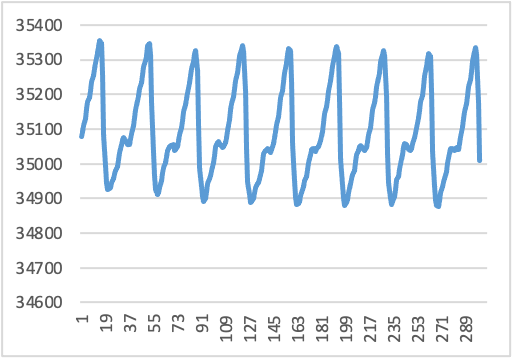
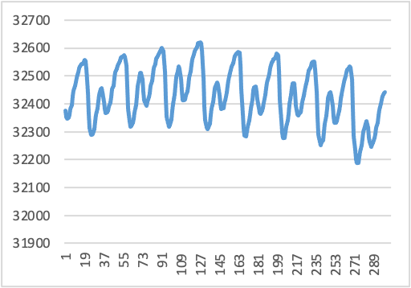

## 臺北市立松山工農112學年度第二學期電子科-感測器實習學習單 

<center><font size=6>【心率感測器 PPG Sensor (Software)】</font></center>

<div style="text-align: right">班級：______________ 座號：________姓名：________________</div>

#### 一、頻率計算方式(簡易版)

將自製的PPG電路板電源接至5V，Vo輸出接至示波器觀察，將OPA放大倍率電阻調整至最大不失真。再將Vo腳位接至Arduino類比接腳(A0)，完成將A0類比電壓輸入後並發送至PC序列埠之簡易程式，再開啟IDE之【工具】-【序列繪圖家】，觀察其波形特點，並記錄波形最大值大約為何？(也可以將序列埠所有資料複製至Excel呈現，未來大學或研究所會將此份資料匯入其他程式分析)

 

量測到的波形最大值：_________________

 


#### 二、程式說明

``` c
unsigned int val, lastval;
float t, Heartrate;

void setup() {
  Serial.begin(9600);
}

void loop() {
  val = analogRead(A0);
  //Serial.println(val);

  if (val < lastval) // 判斷波形有無轉折 上升->下降
  {
    if (val > 450) // 判斷波形有無大於電壓閾(ㄩˋ)值(臨界值, Thershole)
    {
      if (t > 20) // 每個轉折點須>400ms, <2.5Hz, <150BPM (時間閾值)
      {
        Heartrate = (1 / (t * 0.02))\ * 60; // 頻率計算(BPM)
        Serial.print("Heart Rate: ");
        Serial.print(Heartrate);
        Serial.println(" bpm");
        t = 0; // 重新計時
      }
    }
  }

  delay(20); // 取樣頻率50Hz (Sample rate)
  t++; // 大約每20ms時間計時
  lastval = val;
}
```

本程式原理是檢測PPG訊號的上升和下降，並且根據一些條件來計算心率。

1. 判斷波形有無轉折：透過比較兩個連續的取樣值（val和lastval），當val小於lastval時，表示波形發生了上升到下降的轉折。

2. 判斷波形是否大於閾值：透過比較val和450（閾值），判斷波形是否大於這個閾值。只有在波形超過閾值時，才會執行後續的心率計算。

3. 計算心率：根據一個時間變量t（以20ms的間隔增加）和一個預定的時間閾值（20），來判斷兩個轉折點之間的時間間隔是否足夠計算心率。如果時間間隔大於閾值，則根據公式(1 / (t * 0.02)) * 60計算心率（BPM）。

4. 顯示心率：使用Serial.print()將計算出的心率值顯示在序列埠監控視窗上。

 

#### 三、自我練習

1. 焊接後並燒錄，調整兩個閾值(電壓與時間)，觀察是否可以顯示心率於電腦端上。

2. 想想看有沒有其他更好的偵測方式，或是可以改善的方式。


