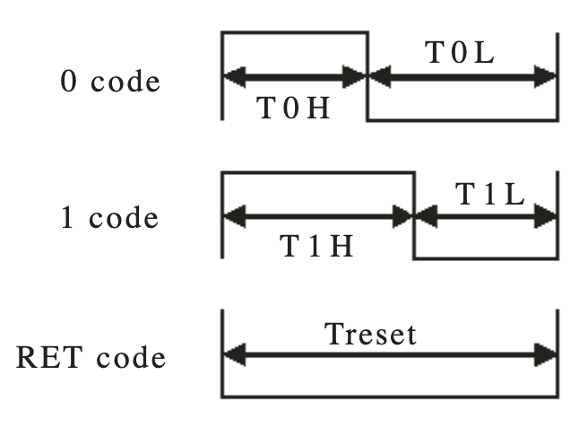
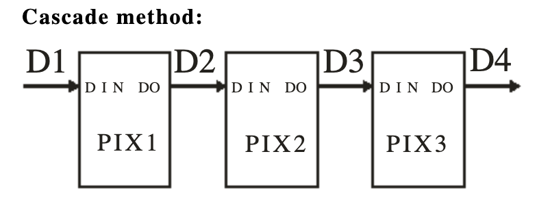
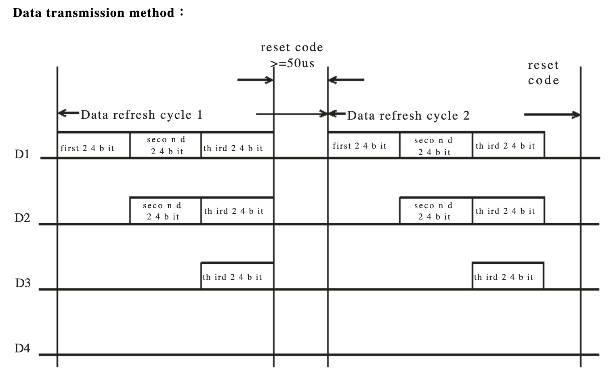
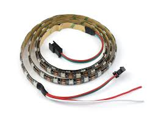
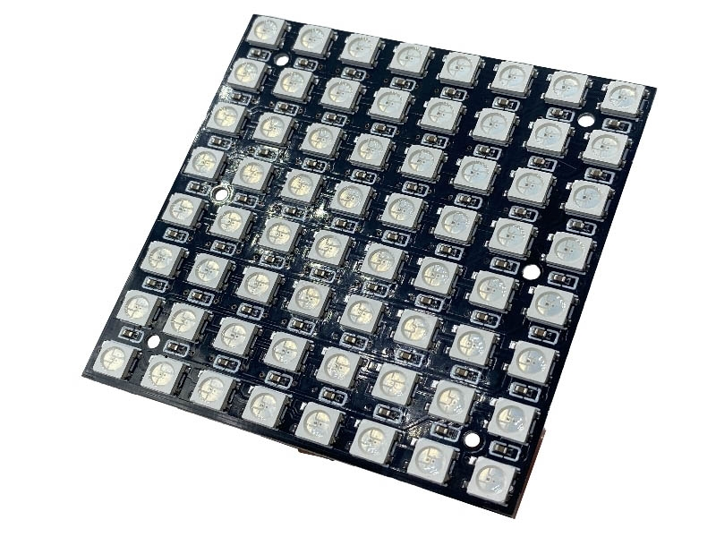
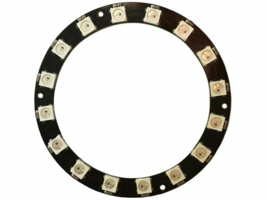

## 臺北市立松山工農112學年度第二學期-感測器實習學習單 

<center><font size=6>【WS2812B LED串列控制】</font></center>


<div style="text-align: right">班級：______________ 座號：________姓名：________________</div>

#### 一、WS2812B

WS2812B 是一種內建驅動 IC 的 RGB LED，常見於 5050 LED 封裝中。它透過串列進出方式來控制每顆 LED，因此可以獨立設定每顆燈的顏色。

每顆 LED 由紅 (R)、綠 (G)、藍 (B) 三個顏色組成，每個顏色可獨立調整 0~255 亮度，共需 24-bit 來控制。 下圖是控制 WS2812B 的時序圖

<center>
    
</center>
WS2812B 常見的模組有 LED 燈條、LED 環形燈等。連接時需要注意 **輸入 (DIN)** 和 **輸出 (DOUT)** 端，輸出端可串接至下一顆 LED 的輸入端，以實現多顆 LED 的串聯控制。

<center>
    
</center>
 

#### 二、函式庫安裝

FastLED 是一款功能強大且易於使用的 LED 控制函式庫，是目前 Arduino 開發者最常使用的 LED 控制庫之一。若遇到版本問題，可選擇安裝較舊的穩定版本。

###### 安裝步驟

1. 打開 Arduino IDE。
2. 依序點選 **工具** → **管理程式庫**。
3. 在搜尋框輸入 `FastLED`，找到對應的函式庫並安裝。

#### 四、程式說明

1. 讓 LED 變成紅色

```c {.line-numbers}
#include "FastLED.h"

#define NUM_LEDS 16      // LED 燈珠數量
#define LED_DT 9         // 控制訊號輸出引腳
#define LED_TYPE WS2812B // LED 類型
#define COLOR_ORDER GRB  // RGB 順序

uint8_t max_bright = 128; // 亮度 (0-255)
CRGB leds[NUM_LEDS];

void setup() {
    FastLED.addLeds<LED_TYPE, LED_DT, COLOR_ORDER>(leds, NUM_LEDS);
    FastLED.setBrightness(max_bright);
    fill_solid(leds, NUM_LEDS, CRGB::Red); // 設定紅色
    FastLED.show();
}

void loop() {}

```

2.  LED 漸變彩虹效果
```c {.line-numbers}
#include "FastLED.h"

#define NUM_LEDS 16      // LED 燈珠數量
#define LED_DT 9         // 控制訊號輸出引腳
#define LED_TYPE WS2812B // LED 類型
#define COLOR_ORDER GRB  // RGB 順序

uint8_t max_bright = 128; // 亮度 (0-255)
CRGB leds[NUM_LEDS];
uint8_t beginHue = 0;
uint8_t deltaHue = 1;

void setup() {
    FastLED.addLeds<LED_TYPE, LED_DT, COLOR_ORDER>(leds, NUM_LEDS);
    FastLED.setBrightness(max_bright);
}

void loop() {
    fill_rainbow(leds, NUM_LEDS, beginHue, deltaHue);
    FastLED.show();
    beginHue++; // 增加色相，產生漸變效果
    delay(25);
}
```

   

#### 五、自我練習

1. 單一 LED 繞圈
      - 讓 LED 繞圈顯示，每完成一圈後變換顏色。
2. 模擬汽車燈光效果
      - 使用三個按鈕模擬左轉、右轉、煞車燈。
      - **左轉 / 右轉燈**：按下時，對應方向的 7 顆 LED 以黃色閃爍，每 0.5 秒交替亮滅。
      - **煞車燈**：按下時，所有 LED 變紅色，放開後熄滅。
      - **優先權**：煞車燈的優先權最高。

