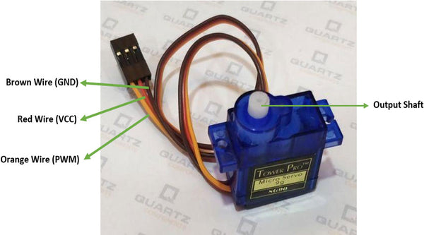
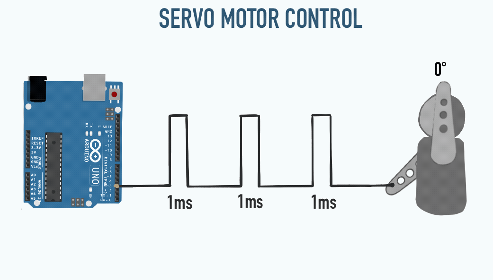
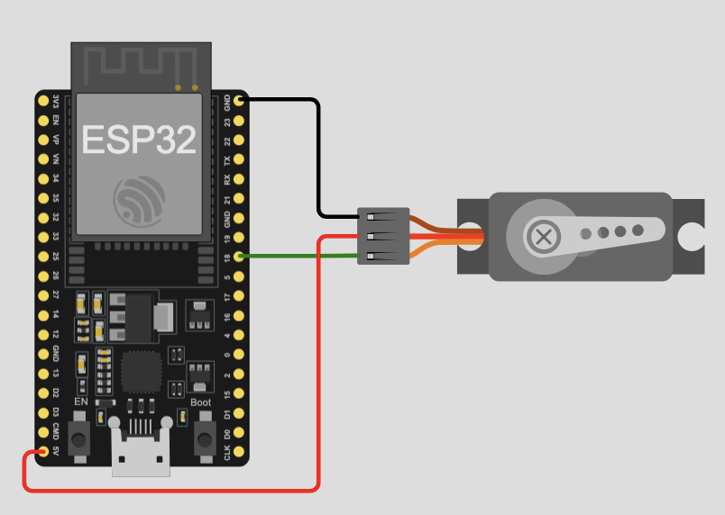

## 臺北市立松山工農113學年度第二學期-感測器實習學習單 

<center><font size=6>【伺服馬達控制】</font></center>


<div style="text-align: right">班級：______________ 座號：________姓名：________________</div>


#### 伺服馬達 (Servo) 介紹

伺服馬達 (Servo Motor) 是一種能夠精確控制角度的馬達，廣泛應用於機器人、遙控車、機械臂等領域。伺服馬達內部包含了一個直流馬達、減速齒輪組、位置感測器以及控制電路。

##### SG90 伺服馬達

SG90 是一款常見的微型伺服馬達，具有以下特性：

- **工作電壓**：4.8V - 6V
- **最大轉動角度**：0 - 180 度
- **控制訊號**：PWM（脈衝寬度調變）
- **工作頻率**：50Hz
- **扭矩**：約 1.8 kg/cm @ 5V
- **重量**：約 9g

SG90 馬達的三條線材顏色及功能如下：

- **橙色 (Signal)**：PWM 訊號輸入

- **紅色 (VCC)**：電源 (4.8V - 6V)

- **棕色 (GND)**：接地

  

#### Servo 與 PWM 的關係

伺服馬達的轉動角度由 PWM 訊號決定，PWM（Pulse Width Modulation）是透過改變脈衝的寬度來控制設備的技術。

##### PWM 控制 SG90

SG90 伺服馬達的控制訊號為 50Hz（即週期為 20ms），根據不同的 PWM 脈衝寬度，伺服馬達會轉到對應角度。

- **0 度**：脈衝寬度約 **0.5ms**
- **90 度**：脈衝寬度約 **1.5ms**
- **180 度**：脈衝寬度約 **2.5ms**

ESP32 內建多個 PWM 控制通道，適合用來驅動伺服馬達。



#### ESP32 使用 Arduino 控制 Servo



```c
#include <ESP32Servo.h>

const int servoPin = 18;

Servo servo;

void setup() {
  servo.attach(servoPin, 500, 2400);
}

int pos = 0;

void loop() {
  for (pos = 0; pos <= 180; pos += 1) {
    servo.write(pos);
    delay(15);
  }
  for (pos = 180; pos >= 0; pos -= 1) {
    servo.write(pos);
    delay(15);
  }
}

```

#### 自我練習題

1. 請修改程式，使伺服馬達以更平滑的方式從 0 度轉動到 180 度，並再回到 0 度。

2. 請撰寫程式，讓伺服馬達根據搖桿的輸入值來控制轉動角度。

