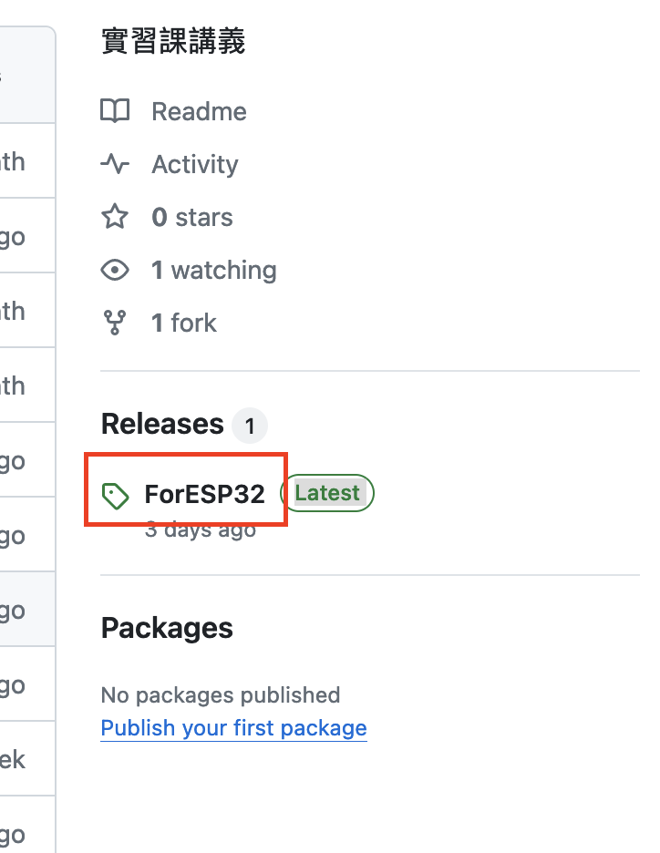
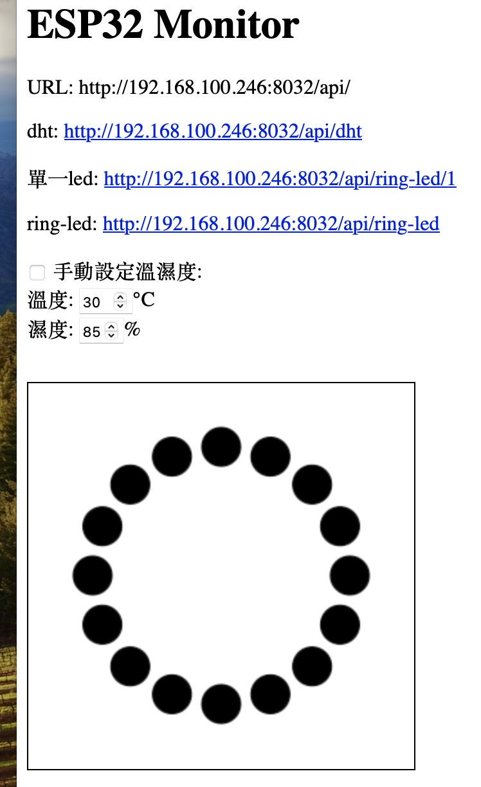

## 臺北市立松山工農112學年度第二學期-智慧居家監控實習學習單

<center><font size=6>【ESP32 虛擬硬體網頁】</font></center>

<div style="text-align: right">班級：______________ 座號：________姓名：________________</div>

#### 一、ESP32 虛擬硬體介紹

由於太多的網頁須要先行註冊才能使用，於是撰寫一個可以提供測試的網頁，而未來也將些一虛擬硬體以 ESP32 來實作完成，達到可以遠端控制的目的。


#### 二、下載及安裝

以瀏覽器開啟 https://github.com/sywung/saihs1122/  。開啟紅色連結，並下載 esp32.exe(可能會被誤判成病毒) 及 web.bat。
<center>


</center>


執行 web.bat，會開啟瀏覽器及一個背景執行的程式(測試期間勿關，可以看到連線的日誌)。若不小心將瀏覽器關掉，只要開啟瀏覽器，並連至 http://127.0.0.1:8032/ 即可開啟網頁。圖上的 URL 即是在 ESP 程式中，要開啟的網頁位址。

電腦主機跟ESP32要處於可互相連接到的網路。

#### 三、測試

可用 瀏覽器中的外掛 RESTer 來進行測試。


按下相對應的連結可得到相關的 json 格式的資料。可用於傳送資料到虛擬硬體。

如: http://192.168.100.246:8032/api/dht 可得到目前的溫濕度(以設每5秒亂數產更新，亦可改手動更新)。

```json
{
  "temperature": 40,
  "humidity": 85
}
```

用 POST 送 json 的資料到 http://192.168.100.246:8032/api/ring-led/1 可改變 第1顆 LED 的顏色, 如下會出現紅色。

```json
{
  "red": 255,
  "green": 0,
  "blue": 0
}
```


#### 四、自我練習

請用 RESTer 控制 環形LED 的顏色。(可利用 http://192.168.100.246:8032/api/ring-led 一次修改16個顏色)

